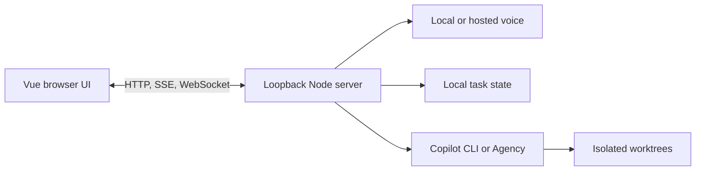

# Invoke

**From Voice to Agency**

Invoke is a voice-first orchestration platform that transforms spoken intent into action, routing tasks across local and cloud models and initiating agentic sessions on the user's behalf.

[Download for Windows](https://github.com/Dhruv-Mishra/Invoke-Voice/releases/latest) | [Setup and operations](docs/operations.md) | [Demo guide](VIDEO_OVERVIEW.md)


<table>
	<tr>
		<td width="70%"></td>
		<td width="30%"></td>
	</tr>
</table>

## What It Does

- Talk or type to an assistant running on local models (Gemma, Qwen) or cloud models (OpenAI, Google).
- Hand coding and research work to GitHub Copilot CLI or Agency, each coding task in its own isolated worktree.
- Keep tasks, follow-ups, notifications, files and your calendar in one place.
- Pick one of three themes (Copilot, Jarvis, Baymax), on desktop or in a narrow window.
- Everything stays on your machine unless you choose a cloud provider or delegate work that needs one.

## Get Started

**Install on Windows x64** from the [latest release](https://github.com/Dhruv-Mishra/Invoke-Voice/releases/latest). Choose **Invoke-Setup-*version*.exe**, which includes the Python speech dependencies, or the smaller **Invoke-Setup-*version*-Online.exe**, which downloads them during setup. Voice models are downloaded separately, only with your consent. Check the SHA-256 file; installers are unsigned, so follow your organization's security policy.

You will need:

- 16 GB of RAM and about 18 GB of free disk for local voice (Qwen needs about 24 GB of each).
- Git, VS Code and a signed-in Copilot CLI or [Agency](https://aka.ms/agency) to delegate work.

**Run from source** with Node.js 22+:

```powershell
npm ci
npm start          # serves http://127.0.0.1:4317
npm run desktop    # or launch the desktop app
```

`npm run dev` adds hot reload. Other commands are in [package.json](package.json).

## Settings

Everything is configured in **Settings**: providers, keys, models and performance. Data lives in `%LOCALAPPDATA%\VoiceSupervisor`, and keys never reach the browser. Cloud speech or models need **Allow cloud processing**. For the full details, see [docs/operations.md](docs/operations.md).

## Local Voice

Local voice is optional. Setup downloads pinned, verified models:

- **Language model:** Gemma 4 E2B (default, 3.35 GB) or Qwen3.6 35B-A3B (opt-in, about 24 GB).
- **Speech recognition:** NVIDIA Parakeet (English, default), Whisper Small (multilingual) or Moonshine Tiny.
- **Speech:** Kokoro, in its own Python environment that leaves your system Python alone.

Models are installed once; each launch only loads them. If speech setup fails, chat still works.

Speak hands-free (a 1.4 s pause ends your turn) or hold push-to-talk. Answers start speaking as soon as the model commits to them. While the model works, a thought bubble grows out of the sprite and says what it is doing; its short spoken lines are generated once, replayed after that, and always finish before the answer.

**Qwen** (Settings > Local model) is larger and more capable. Setup adds a multi-token prediction layer that speeds up generation without changing the output. An optional Vulkan GPU backend exists, but small GPUs can be slower than the CPU, so measure first.

Local models can still choose the wrong action. See [measured results and limits](docs/operations.md#local-acceptance-checks) and the [Qwen upgrade report](UPGRADED_AGENT_REPORT.md).

## Working With Agency

Invoke hands work to **Agency** (default) or **Copilot CLI**:

- **Coding tasks** run in isolated worktrees. Ask follow-ups any time; up to ten queue while work runs.
- **Questions** run as read-only research. Public Microsoft Learn is available by default.
- **Stopping** a task (from its card, its details, or by asking) keeps its history and finished changes. It does not undo them.

To let research read Teams, calendar, email or people data, sign in to Agency with your work account, open **Settings > Integrations > Private work sources**, choose **Read-only** and select **Save access**. Turn on **Direct voice work tools** for faster reads during calls. Write actions are never exposed. Read [Agency delegation](docs/operations.md#agency-delegation) before enabling access.

## Calls And Notifications

- Calls can open with a short greeting. Idle calls check in after 40 s and end after 60 s; both are configurable.
- The inbox keeps the latest 100 task updates. During a call only the newest one is spoken, and quiet mode silences speech.
- Ask Invoke to switch themes, clear or read notifications, or turn spoken updates on or off.

## Privacy And Security

- The server only listens on your machine (loopback), and keys stay in the server process.
- Data, models and logs stay in `%LOCALAPPDATA%\VoiceSupervisor`, even after uninstalling.
- **Settings > Application data > Clear application data** deletes all of it, including managed worktrees, after confirmation. External repositories and Agency credentials are kept.
- Installers are unsigned; do not bypass SmartScreen or organizational policy.

## Themes

Copilot, Jarvis and Baymax each have their own artwork, sounds and voice. Switching themes never interrupts a call. See [media credits](public/immersive/README.md) and the [design guide](design_guide.md).

## Building And Releasing

```powershell
npm run build
npm test
npm run dist:win   # Bundled and Online installers; needs Python 3.12 x64
```

`npm run release:stable:local` publishes the committed stable version from a clean `master`. The in-app updater keeps your edition and verifies every download. See [Windows distribution](docs/operations.md#windows-distribution) and [release checks](docs/operations.md#release-checks).

## Architecture



The main entry points are [public/app.js](public/app.js), [src/server.mjs](src/server.mjs), [src/supervisor.mjs](src/supervisor.mjs) and [src/llm.mjs](src/llm.mjs). Before changing an area, follow its nearest `AGENTS.md` and keep the HTTP, SSE, WebSocket, saved-state, tool and audio contracts stable.