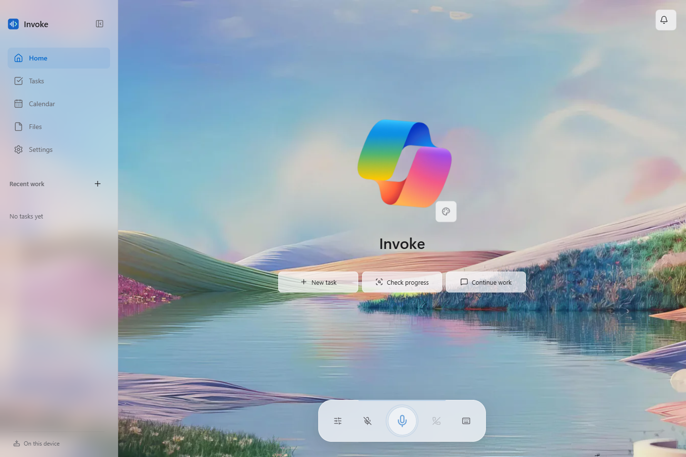
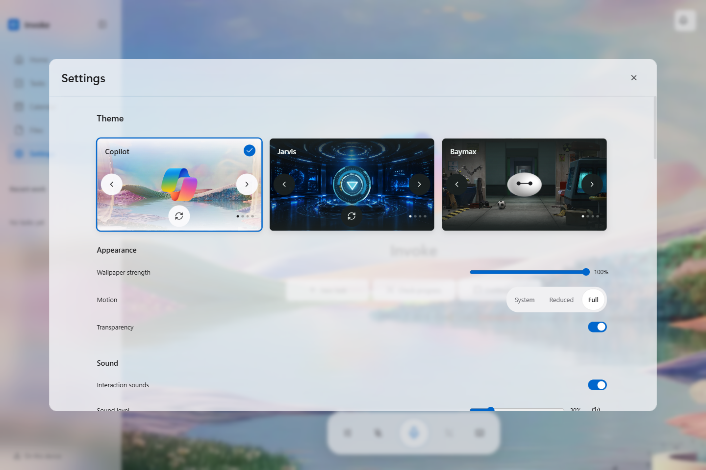
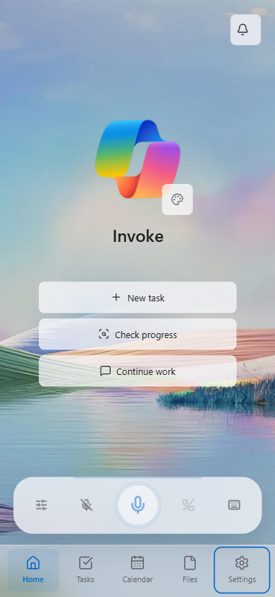
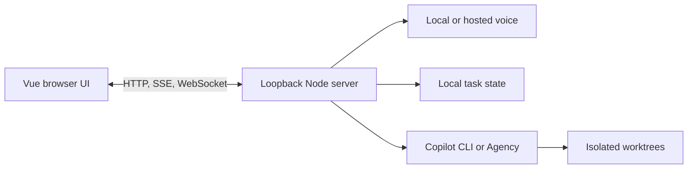

# Invoke

**From Voice to Agency**

Invoke is a voice-first orchestration platform that transforms spoken intent into action, routing tasks across local and cloud models and initiating agentic sessions on the user's behalf.

[Download for Windows](https://github.com/Dhruv-Mishra/Invoke-Voice/releases/latest) | [Setup and operations](docs/operations.md) | [Demo guide](VIDEO_OVERVIEW.md)



<table>
	<tr>
		<td width="70%"></td>
		<td width="30%"></td>
	</tr>
</table>

## What It Does

- Runs text or voice conversations with local, OpenAI, or Google models.
- Delegates coding work to Copilot CLI or Agency in isolated worktrees.
- Tracks tasks, queued follow-ups, notifications, files, and calendar context.
- Offers three local visual themes with responsive desktop and narrow-window layouts.
- Keeps the server, state, models, and credentials local unless a selected provider or delegated tool requires external processing.

## Requirements

Download **Invoke-Setup-1.0.0.exe** for the bundled Python dependency pack, or **Invoke-Setup-1.0.0-Online.exe** for a smaller installer that downloads that pack during consented setup. Neither edition bundles voice models. Verify the accompanying SHA-256 checksum. Installers are unsigned; follow Windows and organizational security policy.

- Node.js 22+ and npm to run from source.
- Windows x64 for the packaged desktop app and managed local voice setup.
- Git, VS Code, and an authenticated GitHub Copilot CLI or [Agency client](https://aka.ms/agency) for delegated work.
- 12 GB free disk space for local voice setup; 16 GB RAM is recommended.

The desktop package includes Node. Managed setup uses an isolated Python environment and does not modify system Python or `PATH`.

## Quick Start

```powershell
npm ci
npm start
```

Open the printed loopback URL, normally `http://127.0.0.1:4317`. To launch Electron instead:

```powershell
npm run desktop
```

| Command | Purpose |
| --- | --- |
| `npm start` | Run the release server. |
| `npm run dev` | Run the backend with Vite middleware and HMR. |
| `npm run local` | Start the local LLM and supervisor. |
| `npm run local:check` | Check the local tool-capable LLM path, then exit. |
| `npm run desktop` | Build and launch Electron. |
| `npm run build` | Build production frontend assets. |
| `npm test` | Run deterministic backend and browser tests. |

## Configuration

Use **Settings > Config** for providers, models, endpoints, defaults, and local setup. State is stored under `%LOCALAPPDATA%\VoiceSupervisor`; secrets are never returned to the browser. Cloud stages require **Allow cloud processing**.

See [docs/operations.md](docs/operations.md) for data locations, local voice provisioning, Agency access boundaries, call behavior, and release procedures.

## Agency Tasks

Agency is the fresh-install default; saved backend choices are preserved. Coding tasks use isolated worktrees. Read-only questions always use a restricted Agency profile, with public Microsoft Learn available by default and enterprise data access disabled until explicitly enabled.

Follow-ups reuse the original task session. Up to ten messages can queue while work runs; interrupted queues pause until a corrective follow-up resumes them. See [docs/operations.md](docs/operations.md#agency-delegation) before enabling WorkIQ, Teams, calendar, or people access.

Invoke starts its Agency connections and checks tool catalogs on entry. A concise setup dialog identifies missing installation, sign-in, connectivity, or optional access steps. Catalog readiness is not proof of authorization to read a particular account or source. Consent is never enabled silently.

## Local Voice

Local setup is opt-in and provisions:

- Ling through llama.cpp for chat and tool calls.
- Moonshine Streaming Tiny by default, or Whisper Small for multilingual recognition.
- Kokoro for speech synthesis in an isolated Python 3.12 environment.

Downloads are pinned and hash-verified. Working chat remains available if speech setup fails. Detailed model, mirror, and release-pack behavior is documented in [docs/operations.md](docs/operations.md#voice-routes).

## Calls And Notifications

Calls open with an optional short greeting. The red hang-up control ends an active call. Idle calls check in after 40 seconds and end after 60 seconds by default; both values are configurable.

The inbox shows concise task-outcome headings; full answers stay in task details. Announcements are queued and deduplicated. Text chat and local/hybrid voice withhold tool-round prose until the final response; native hosted realtime speech remains provider-controlled. The inbox retains the latest 100 updates; quiet mode suppresses speech without removing history.

Ask Invoke to switch themes, clear notifications, mark them read, or turn spoken updates on or off. These controls use the same persisted state as the UI and cannot change credentials or Agency access consent.

## Data And Security

- HTTP, SSE, and WebSocket listeners bind to loopback only.
- Provider keys stay in the server process and local config file.
- Runtime state, models, caches, and logs stay under `%LOCALAPPDATA%\VoiceSupervisor`.
- Logs are replaced or bounded; setup diagnostics are sanitized before presentation.
- Models, credentials, state, tests, and generated installers are excluded from packaged builds.
- Uninstall retains user data and model caches unless the user removes them while the app is closed.

The installer is unsigned unless the distributor adds signing. Windows SmartScreen or organizational policy may block it; do not bypass those controls.

## Desktop Builds And Releases

Build both unsigned per-user Windows x64 installers (requires Python 3.12 x64):

```powershell
npm run dist:win
```

Outputs under `release/` include Bundled and Online installers plus SHA-256 sidecars. Use `npm run dist:win:bundled` or `npm run dist:win:online` for one edition. Publishing and pack requirements are in [docs/operations.md](docs/operations.md#windows-distribution).

`npm run release:stable:local` validates and publishes the committed stable version from clean `master`. The updater uses Electron's proxy-aware networking, preserves the installed edition, and falls back to a public release manifest when the GitHub API is unavailable. Downloads require matching SHA-256 sidecars.

## Themes

Copilot, Jarvis, and Baymax themes use local bitmap artwork and Ogg cues. Appearance changes do not restart active voice or text sessions. Media provenance and distribution warnings are documented in [public/immersive/README.md](public/immersive/README.md); implementation rules live in [design_guide.md](design_guide.md).

Run `node scripts/theme-assets.mjs` with FFmpeg to regenerate normalized backgrounds and cues from `voice_app_assets`. Normal builds consume checked-in assets and do not run this preparation step.

## Architecture



The primary ownership boundaries are [public/app.js](public/app.js), [src/server.mjs](src/server.mjs), [src/supervisor.mjs](src/supervisor.mjs), and [src/llm.mjs](src/llm.mjs). Focused browser modules live under `public/captions/`, `public/setup/`, `public/settings/`, and `public/tools/`.

Follow the nearest `AGENTS.md` before changing an owned area. Preserve HTTP, SSE, WebSocket, persisted-state, tool-schema, prompt, and audio contracts.

## Validation

```powershell
npm run build
npm test
```

Packaged checks and target-device validation are covered in [docs/operations.md](docs/operations.md#release-checks).