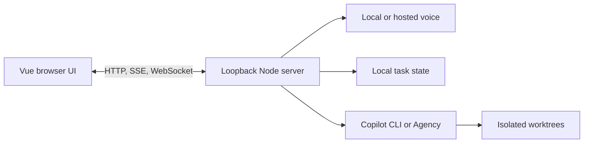

# Invoke

**From Voice to Agency**

Invoke is a voice-first orchestration platform that transforms spoken intent into action, routing tasks across local and cloud models and initiating agentic sessions on the user's behalf.

[Download for Windows](https://github.com/Dhruv-Mishra/Invoke-Voice/releases/latest) | [Setup and operations](docs/operations.md) | [Demo guide](VIDEO_OVERVIEW.md)


<table>
	<tr>
		<td width="70%"></td>
		<td width="30%"></td>
	</tr>
</table>

## What It Does

- Runs text or voice conversations with local, OpenAI, or Google models.
- Delegates coding work to Copilot CLI or Agency in isolated worktrees.
- Tracks tasks, queued follow-ups, notifications, files, and calendar context.
- Offers three local visual themes with responsive desktop and narrow-window layouts.
- Keeps the server, state, models, and credentials local unless a selected provider or delegated tool requires external processing.

## Requirements

Download **Invoke-Setup-1.0.1.exe** for the bundled Python dependency pack, or **Invoke-Setup-1.0.1-Online.exe** for a smaller installer that downloads that pack during consented setup. Neither edition bundles voice models. Verify the accompanying SHA-256 checksum. Installers are unsigned; follow Windows and organizational security policy.

- Node.js 22+ and npm to run from source.
- Windows x64 for the packaged desktop app and managed local voice setup.
- Git, VS Code, and an authenticated GitHub Copilot CLI or [Agency client](https://aka.ms/agency) for delegated work.
- At least 18 GB free disk space for local voice setup, more if retaining old models; 16 GB RAM is recommended and performance varies with available memory.

The desktop package includes Node. Managed setup uses an isolated Python environment and does not modify system Python or `PATH`.

## Quick Start

```powershell
npm ci
npm start
```

Open the printed loopback URL, normally `http://127.0.0.1:4317`. To launch Electron instead:

```powershell
npm run desktop
```

| Command | Purpose |
| --- | --- |
| `npm start` | Run the release server. |
| `npm run dev` | Run the backend with Vite middleware and HMR. |
| `npm run local` | Start the local LLM and supervisor. |
| `npm run local:check` | Check the local tool-capable LLM path, then exit. |
| `npm run desktop` | Build and launch Electron. |
| `npm run build` | Build production frontend assets. |
| `npm test` | Run deterministic backend and browser tests. |

## Configuration

Use **Settings > Providers & keys** for providers, models, endpoints, defaults, and local performance. State is stored under `%LOCALAPPDATA%\VoiceSupervisor`; secrets are never returned to the browser. Cloud stages require **Allow cloud processing**.

See [docs/operations.md](docs/operations.md) for data locations, local voice provisioning, Agency access boundaries, call behavior, and release procedures.

## Agency Tasks

Agency is the fresh-install default; saved backend choices are preserved. Coding tasks use isolated worktrees. Read-only questions always use a restricted Agency profile, with public Microsoft Learn available by default and enterprise data access disabled until explicitly enabled.

Follow-ups reuse the original task session. Up to ten messages can queue while work runs; interrupted queues pause until a corrective follow-up resumes them. See [docs/operations.md](docs/operations.md#agency-delegation) before enabling WorkIQ, Teams, calendar, or people access.

Use **Stop task** in task details, the square Stop icon on a task card, or ask the assistant to cancel a task. This stops its owned execution and discards queued follow-ups, preserving history, worktrees and already completed changes. Cancellation does not roll back edits or external actions.

Invoke starts its Agency connections and checks tool catalogs on entry. A concise setup dialog identifies missing installation, sign-in, connectivity, or optional access steps. Catalog readiness is not proof of authorization to read a particular account or source. Consent is never enabled silently.

**Enable Teams and calendar:** install and sign in to [Agency](https://aka.ms/agency) with your work account. Open **Settings > Integrations > Private work sources**, choose **Read-only**, then **Save access**. This is Invoke's research permission, not an Agency setting or a grant of Microsoft 365 access. Questions and answers use cloud services, are saved, and may be spoken.

For lower-latency reads during a voice call, also enable **Direct voice work tools**. Invoke then discovers approved WorkIQ, Teams, calendar, people, or Microsoft Learn schemas only when the voice model asks for them and calls the selected read tool directly, without creating an Agency task. The feature is off by default and never exposes write or delegated `ask` operations.

No restart is required after saving access. New research tasks and subsequent follow-ups use the saved permission; an already-running task keeps its original tools. Coding and research sessions use task-local Agency profiles to avoid inheriting incompatible global Copilot MCP entries. Explicit Invoke MCPs and coding repository MCP configuration remain available.

Installing Agency does not start Teams MCP. Invoke explicitly runs `agency mcp --transport http --port 0 teams` on app launch, alongside its WorkIQ and Bluebird proxies. **Check connections** starts or retries these proxies without reading business content. From source, `npm run agency:setup:check` verifies all research catalogs and closes its temporary proxies; it never changes consent.

**Calendar** opens your Outlook work calendar or checks today's schedule through a read-only Agency task. Outlook and Teams share that Microsoft 365 calendar. Results appear in task details; no calendar data is read just by opening the tab. You can also ask Invoke to check your calendar by voice or chat.

## Local Voice

Local setup is opt-in and provisions:

- Gemma 4 E2B IT QAT Q4_0 through llama.cpp for chat and tool calls, or the opt-in Qwen3.6 35B-A3B mixture-of-experts model.
- Whisper Small CPU INT8 by default; Moonshine Streaming Tiny is opt-in.
- Kokoro for speech synthesis in an isolated Python 3.12 environment.

Downloads are pinned and hash-verified. Working chat remains available if speech setup fails. Detailed model, mirror, and release-pack behavior is documented in [docs/operations.md](docs/operations.md#voice-routes).

Each desktop launch initializes the installed models in memory; it does not reinstall them. Settings labels this **Initializing** and hides download consent when every component is installed. Kokoro has up to three minutes for cold initialization, including its automatic warm-up. **Retry voice** restarts installed runtimes without rerunning installation; no separate warm-up command is needed.

The Gemma text model is 3.35 GB. Previously consented, verified managed Ling Compact/Quality installations upgrade on startup; custom model paths and fresh-install consent are preserved. Previous files stay on disk. Gemma passed the expanded 21-case synthetic tool gate after API fixes, but is slower than Ling on the measured CPU. See the [comparison and limitations](docs/operations.md#local-acceptance-checks); this is not a guarantee across requests or hardware. The `ling-local` endpoint alias remains for compatibility.

Local turns use llama.cpp JSON-schema generation: either a validated tool batch or an answer, never executable XML embedded in prose. Answer text streams to captions and speech as soon as the grammar has committed to the answer branch; tool envelopes are never published. After tools, a separate tool-free summary receives bounded outcomes and titles without routing IDs or action names. This adds a local generation pass but prevents routing output from becoming speech. Thinking stays disabled; warm-up uses the same contract. With Whisper and Regular routing, **Early reply preparation** sends the provisional transcript to the local model while the end-of-speech pause is still being confirmed, so the prompt is already cached when the final transcript arrives.

### Opt-in Qwen3.6 35B-A3B

**Settings > Local model** switches the local model to [Qwen3.6-35B-A3B Uncensored Aggressive Q4_K_P](https://huggingface.co/HauhauCS/Qwen3.6-35B-A3B-Uncensored-HauhauCS-Aggressive) (about 3B active parameters per token, 23.4 GB). Setup reuses a copy in `LocalVoiceStack/LLMs` or the Qwen path setting after verifying its pinned SHA-256, otherwise it downloads the pinned file. It needs about 24 GB of free RAM. With **Qwen multi-token prediction** on (default), setup downloads only the 0.5 GB MTP layer of the pinned [Qwen3.6 MTP GGUF](https://huggingface.co/unsloth/Qwen3.6-35B-A3B-MTP-GGUF) by byte range and merges it into one 24 GB model file; a fresh download streams straight into that file, and a managed original is removed after the merge, so Qwen needs about 24 GB of disk. llama.cpp then drafts two tokens per step and verifies them, so output is unchanged. A copy you supplied in `LocalVoiceStack/LLMs` or the Qwen path is never deleted, but it is no longer needed once setup finishes. Qwen uses its own threads, context and draft settings, one slot, flash attention and no memory mapping. Selecting Qwen opens a confirmation that lists the memory and disk cost, and choosing Keep Gemma restores the previous selection. Qwen tool rounds also get a short extra prompt about keeping user constraints, finishing every part of a request, and asking when a target is unclear. `npm run models -- qwen` performs the same verification and build from the command line. See [the upgrade report](UPGRADED_AGENT_REPORT.md) for measured speed and accuracy.

**Local LLM compute backend > Vulkan** downloads the pinned llama.cpp Vulkan build for GPU offload on NVIDIA, AMD or Intel GPUs; GPU layers `auto` lets llama.cpp fit what VRAM allows and keep the remaining MoE experts on the CPU. GPUs with little VRAM can be slower than the CPU path (a 4 GB T400 was), so measure before keeping it.

Local text and voice allow at most three tool rounds and six executed calls per turn, followed by a tool-free answer. Hosted providers retain eight rounds. Independent calls run concurrently; invalid local batches fail before dispatch. Successful calls reuse receipts, including subject-to-ID retries; failures remain retryable. Read-only first batches cannot escalate to changes, while action batches may read results. This guard follows the model's selected calls, not independent authorization of user intent. Task tools accept a subject directly and clarify ambiguous matches. `delete_work` with `all:true` deletes task chats, stops owned work and keeps files; protected work is reported as a partial failure. Worker model/backend selection comes from Settings, not generated arguments.

Whisper is the fresh default; saved Moonshine choices remain unchanged. Select **Whisper** in **Settings > Providers & keys > Local speech** and complete setup to switch an existing installation. Hands-free speech waits for 1.4 seconds of silence by default; both recognizers expose their pause threshold in Settings. Whisper push-to-talk holds the utterance until release, including pauses while held. Interrupted announcements and duplicate recognition finals are not replayed. Recognition accuracy and latency still depend on microphone, speech and hardware.

Setup shows download percentage, bytes and an approximate time remaining for the current component. Verification, unpacking and startup use an indeterminate bar rather than a guessed installation time.

## Calls And Notifications

Calls open with an optional short greeting. The red hang-up control ends an active call. Idle calls check in after 40 seconds and end after 60 seconds by default; both values are configurable.

The inbox shows concise task-outcome headings; full answers stay in task details. New calls never announce the existing inbox backlog. Only the latest pending update received during the active call is eligible for speech; superseded updates remain in the inbox. Text-model routes publish completed final answers without prose rewriting; native hosted realtime speech remains provider-controlled. The inbox retains the latest 100 updates; quiet mode suppresses speech without removing history.

Ask Invoke to switch themes, clear notifications, mark them read, or turn spoken updates on or off. These controls use the same persisted state as the UI and cannot change credentials or Agency access consent.

## Data And Security

- HTTP, SSE, and WebSocket listeners bind to loopback only.
- Provider keys stay in the server process and local config file.
- Runtime state, models, caches, and logs stay under `%LOCALAPPDATA%\VoiceSupervisor`.
- Logs are replaced or bounded; setup diagnostics are sanitized before presentation.
- Models, credentials, state, tests, and generated installers are excluded from packaged builds.
- Uninstall retains user data and model caches unless the user removes them while the app is closed.

**Settings > Application data > Clear application data** permanently deletes the installed app's data after confirmation and restarts into fresh setup. This includes saved keys, history, managed worktrees (including uncommitted work), models, runtimes and browser data. External repositories, custom files, source `.env` and Agency credentials/session storage are preserved. This action is unavailable in source/browser runs.

The installer is unsigned unless the distributor adds signing. Windows SmartScreen or organizational policy may block it; do not bypass those controls.

## Desktop Builds And Releases

Build both unsigned per-user Windows x64 installers (requires Python 3.12 x64):

```powershell
npm run dist:win
```

Outputs under `release/` include Bundled and Online installers plus SHA-256 sidecars. Use `npm run dist:win:bundled` or `npm run dist:win:online` for one edition. Publishing and pack requirements are in [docs/operations.md](docs/operations.md#windows-distribution).

`npm run release:stable:local` validates and publishes the committed stable version from clean `master`. The updater uses Electron's proxy-aware networking, preserves the installed edition, and falls back to a public release manifest when the GitHub API is unavailable. Downloads require matching SHA-256 sidecars.

## Themes

Copilot, Jarvis, and Baymax themes use local bitmap artwork and Ogg cues. Appearance changes do not restart active voice or text sessions. Media provenance and distribution warnings are documented in [public/immersive/README.md](public/immersive/README.md); implementation rules live in [design_guide.md](design_guide.md).

Run `node scripts/theme-assets.mjs` with FFmpeg to regenerate normalized backgrounds and cues from `voice_app_assets`. Normal builds consume checked-in assets and do not run this preparation step.

## Architecture



The primary ownership boundaries are [public/app.js](public/app.js), [src/server.mjs](src/server.mjs), [src/supervisor.mjs](src/supervisor.mjs), and [src/llm.mjs](src/llm.mjs). Focused browser modules live under `public/captions/`, `public/setup/`, `public/settings/`, and `public/tools/`.

Follow the nearest `AGENTS.md` before changing an owned area. Preserve HTTP, SSE, WebSocket, persisted-state, tool-schema, prompt, and audio contracts.

## Validation

```powershell
npm run build
npm test
```

Packaged checks and target-device validation are covered in [docs/operations.md](docs/operations.md#release-checks).