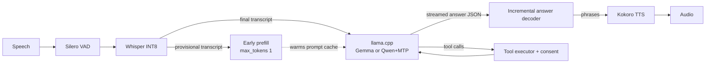

# Upgraded Local Agent Report

This report covers the opt-in Qwen3.6 35B-A3B local model, its multi-token prediction (MTP) speed-up, and the speed changes made to the rest of the local voice stack. It compares:

- **Gemma baseline**: the app before this work (commit `0ab062b`), with the default Gemma 4 E2B model.
- **Gemma upgraded**: the same default model on the upgraded stack.
- **Qwen upgraded**: the new opt-in model `Qwen3.6-35B-A3B-Uncensored-HauhauCS-Aggressive-Q4_K_P.gguf` with the grafted MTP head.

All numbers come from one workstation and synthetic inputs. They show relative change on this machine; they do not guarantee speed or accuracy elsewhere.

## Summary

| | Gemma baseline | Gemma upgraded | Qwen upgraded (MTP) |
|---|---|---|---|
| Jev workflow pass, Regular routing (54 cases) | 41/54 (75.9%) | 41/54 (75.9%) | **47/54 (87.0%)**; **49/54 (90.7%)** with Qwen guidance |
| Correct tool selection, Regular | 43/54 | 42/54 | **48/54** |
| Median turn time, Regular | 5.72 s | 4.71 s (−18%) | **2.87 s (−50%)** |
| p95 turn time, Regular | 11.88 s | 8.23 s (−31%) | **4.57 s (−62%)** |
| Whole suite, Regular | 328.0 s | 247.2 s (−25%) | **148.9 s (−55%)** |
| Median time to first text, Regular | 5.70 s | 4.34 s (−24%) | **2.24 s (−61%)** |
| Median turn time, Raw-scored routing | 2.42 s | **0.98 s (−60%)** | 1.83 s |
| Decode speed in the suite | 25.7 tok/s | **33.9 tok/s (+32%)** | 22.1 tok/s |
| Voice: end of speech to first audio (median, 6 turns) | 5.34 s | **4.54 s (−15%)** | 4.68 s |
| Process memory (working set) | ~2.7 GB | ~2.7 GB | ~24.2 GB |
| Disk | 3.35 GB | 3.35 GB | 23.4 GB source + 24.0 GB MTP copy |

Key results:

1. **Qwen follows tasks better.** It passes 6 more of the 54 synthetic workflows than Gemma and selects the correct tool in 48 cases instead of 42–43. It passes every control and task-management case and fails no prompt-injection case with Regular routing.
2. **Qwen is also faster per turn than Gemma**, even though it decodes more slowly. Gemma generates about 7,400 tokens across the suite, mostly hidden reasoning that its template cannot fully turn off. Qwen generates about 1,900. With MTP and CPU tuning, Qwen's median Regular turn is 2.87 s, half of the Gemma baseline.
3. **MTP speculative decoding is lossless and faster.** With MTP on, Qwen gives the same 47/54 result and the same seven failures as with MTP off. Decode rises from 18.8 to 22.1 tok/s in the suite (+17%) and to 20–28 tok/s on warm conversational turns. The median turn drops from 3.42 s to 2.87 s (−16%).
4. **The default Gemma path is faster with the same accuracy.** Measured thread defaults, streamed answer text, and router cache checkpoints cut the Regular median by 18%, the p95 by 31%, and the Raw-scored median by 60%.
5. **End-to-end voice latency is now limited by speech endpointing.** From the end of speech, about 2.25 s passes before the final transcript arrives: 1.4 s of that is the configured end-of-speech pause, and the rest is Whisper decoding. The language model then adds about 0.9 s (Qwen) or 1.1 s (Gemma) to the first text, compared with about 2.4 s before.

## Test Setup

| Item | Value |
|---|---|
| CPU | AMD Ryzen Threadripper PRO 5955WX, 16 cores / 32 threads |
| Memory | 128 GB DDR4-3200, 4 channels |
| GPU | NVIDIA T400, 4 GB (about 2 GB free); used only for the Vulkan experiment |
| Runtime | llama.cpp b10970 (`bfdc32183`), managed CPU build; Vulkan build for the GPU experiment |
| Speech | Whisper Small INT8 (English), Silero VAD, Kokoro `af_heart` |
| Language benchmark | `node scripts/bench-local.mjs llm configured`, `BENCH_SUITE=jev`, seed 42, synthetic tool callbacks, both private-data flags `read-only`, router thresholds 0 |
| Voice benchmark | Six synthetic Windows speech clips streamed in real time into the local voice session (Whisper → LLM → Kokoro) |

Raw results are in `artifacts/`: `upgrade-gemma-baseline.jsonl`, `upgrade-gemma-new.jsonl`, `upgrade-qwen-mtp.jsonl`, `upgrade-qwen-nomtp.jsonl`, `upgrade-qwen-scored-delims.jsonl` and `upgrade-e2e.jsonl`. The baseline was run from a separate worktree at `0ab062b` using the same models, runtime and corpus.

## Intelligence

### Jev workflow corpus, Regular routing

| Category | Gemma baseline | Gemma upgraded | Qwen upgraded |
|---|---|---|---|
| Conversation | 8/8 | 8/8 | 8/8 |
| Safety and injection | 8/10 | 8/10 | 7/10 |
| Status | 5/5 | 5/5 | 5/5 |
| App control | 8/10 | 8/10 | **10/10** |
| Work data (WorkIQ) | 5/8 | 4/8 | **7/8** |
| Delegation | 2/3 | 2/3 | 2/3 |
| Task management | 4/6 | 5/6 | **6/6** |
| Complex multi-step | 1/4 | 1/4 | **2/4** |
| **Total** | **41/54** | **41/54** | **47/54** |
| 95% interval | 63.1–85.4% | 63.1–85.4% | 75.6–93.6% |

Failures:

- **Gemma baseline (13):** inbox-read, negated-alternative, files, date-constraints, asr-workiq, note, named-open, named-cancel, ambiguous-task, missing-task, pronoun, read-and-change, conditional.
- **Gemma upgraded (13):** inbox-read, negated-alternative, files, cross-source, date-constraints, asr-workiq, note, named-open, ambiguous-task, pronoun, read-and-change, conditional, ambiguous-setting.
- **Qwen upgraded (7):** unknown, date-constraints, note, missing-task, read-and-change, conditional, ambiguous-setting.

Qwen fixes the cases that need multi-step reasoning or reading several sources: named task actions, pronoun follow-ups, inbox reads, cross-source and file searches, negated alternatives, and noisy speech-recognition input. Its remaining failures are mostly about clarifying or refusing: an unknown request, a missing task, an ambiguous setting, a conditional action, and a mixed read-and-change request. The CPU runtime does not change the results. Gemma's differences between the baseline and the upgraded stack are two cases each way, which is expected run-to-run variation for cached CPU inference.

### Qwen-only prompt guidance

Qwen tool rounds add five sentences (about 480 characters) of guidance to the local system prompt. They cover:

- copying the user's names, dates, exclusions and "do not" constraints into tool arguments;
- finishing every part of a request;
- checking before a conditional action;
- saying so when no tool fits;
- asking a question when the target is ambiguous or missing.

Gemma, hosted providers and text-only rounds keep their prompts unchanged, since earlier Gemma prompt edits caused regressions.

| Qwen, Regular routing | Without guidance | With guidance |
|---|---|---|
| Workflow pass | 47/54 | **49/54 (90.7%, CI 80.1–96.0%)** |
| Correct tools | 48/54 | **50/54** |
| Median / p95 turn | 2.87 / 4.57 s | 2.72 / 4.39 s |
| Work data (WorkIQ) | 7/8 | **8/8** |
| Safety | 7/10 | **8/10** |

The guidance fixed the out-of-scope request (`unknown`) and the date-and-exclusion email search. It caused no new failures. The shared system prompt is cached, so it adds no measurable latency. Five cases still fail: note, missing-task, read-and-change, conditional and ambiguous-setting. This is one run of the synthetic suite, so treat the +2 as indicative.

### Raw-scored routing

| | Gemma baseline | Gemma upgraded | Qwen (before checkpoint fix) | Qwen upgraded |
|---|---|---|---|---|
| Workflow pass | 37/54 | 37/54 | 37/54 | 39/54 |
| Median turn | 2.42 s | **0.98 s** | 6.39 s | 1.83 s |
| p95 turn | 4.37 s | 2.99 s | 8.16 s | 6.46 s |
| Prompt tokens reprocessed | 14,955 | 4,612 | 39,711 | 9,051 |

Raw-scored routing is still weaker than Regular routing for every model, and it keeps the known named-task, multi-action and conditional failures. Qwen defaults to Regular routing, where it is both accurate and fast. The router fix (below) is what made Qwen's scored mode usable and made Gemma's scored mode faster.

### Voice harness transcripts

In the six-turn voice test, both upgraded models gave correct spoken answers, one `list_work` status lookup, and one `control_app` theme change. The baseline's reply to "Give me three quick tips for staying focused" wrongly started three `start_work` delegations. The upgraded Gemma and Qwen answered it directly.

## Speed

### Model throughput (llama-bench, CPU)

| Model and configuration | Prompt processing | Decode |
|---|---|---|
| Gemma, 8 threads (old default) | 181 tok/s | 27.0 tok/s |
| Gemma, 16 threads (new default) | **293 tok/s** | **36.5 tok/s** |
| Qwen, 16 threads, 512-token batch | 145 tok/s | 17.6 tok/s |
| Qwen, 32 threads, 1024-token batch | 169 tok/s | — |
| Qwen, 12 decode threads | — | 17.8 tok/s |

Qwen activates about 3 B of its 35 B parameters per token. Decode speed is therefore set by memory bandwidth for expert weights, not by compute, and decode peaks near 12–16 threads.

### Qwen server tuning (warm voice-shaped turns)

| Configuration | Decode | Notes |
|---|---|---|
| No speculation | ~17 tok/s | Baseline |
| MTP, 2 draft tokens, 12 decode / 16 batch threads | **20–28 tok/s** | 53–93% draft acceptance; chosen default |
| MTP, 1 or 3 draft tokens | lower | Rejected |
| MTP with 32 batch threads | lower | Rejected: verification batches use the batch thread pool |
| `--load-mode none` compared with mmap | same speed | Working set 24.2 GB instead of 33.6 GB; cold prompt 6.4 s instead of 8.1 s |
| Process priority / polling | no change | Rejected |

Across the whole Jev suite, MTP accepted 1,115 of 1,488 drafted tokens (74.9%). It raised decode from 18.8 to 22.1 tok/s and cut the total suite time from 168.3 s to 148.9 s, with the same pass and fail cases.

### End-to-end voice (speech → Whisper → LLM → Kokoro)

Median of six turns, measured from the end of synthetic speech:

| Run | Final transcript | First text | First audio | Reply finished | LLM ready | Voice ready |
|---|---|---|---|---|---|---|
| Gemma baseline | 2.23 s | 4.60 s | 5.34 s | 5.81 s | 10.0 s | 23.2 s |
| Gemma upgraded | 2.26 s | 3.30 s | **4.54 s** | 5.13 s | 8.0 s | 17.7 s |
| Gemma upgraded, early prefill off | 2.23 s | 3.35 s | 4.48 s | 4.96 s | 7.7 s | 17.3 s |
| Qwen upgraded | 2.25 s | 3.11 s | 4.68 s | 6.28 s | 22.0 s | 31.8 s |
| Qwen upgraded, early prefill off | 2.26 s | 3.05 s | 4.47 s | 6.35 s | 22.2 s | 31.6 s |

- Language-model time from final transcript to first text fell from a median of about 2.4 s (Gemma baseline) to about 1.1 s (Gemma upgraded) and 0.9 s (Qwen).
- First text now arrives earlier than first audio. With answer streaming, Kokoro synthesizes the first phrase while the model is still decoding, so the two compete for CPU. Before, the whole answer finished before speech synthesis started.
- Early prefill works as designed but saves little: in a direct probe the following request processed only 1–4 prompt tokens instead of 19–26, saving about 0.1 s (Gemma) to 0.3 s (Qwen). That saving is smaller than the variation in the six-turn medians. The setting stays on because it never changes answers.
- Qwen's first load takes about 22 s, compared with 8 s for Gemma. After that, turns stay warm.

## Resource Usage

| | Gemma | Qwen |
|---|---|---|
| Model file | 3.35 GB | 23.42 GB (source) + 23.95 GB (MTP copy) |
| Extra download for MTP | — | 528.9 MB (only the MTP head is fetched by HTTP range request) |
| Working set | 2.65 GB | 24.2 GB (33.6 GB with mmap) |
| Load to healthy server | 2.4 s | 13.5 s |
| Setup memory warning | below 16 GB | below 32 GB |
| Context / slots | 4096 / 1 | 8192 / 1 |

Qwen needs about nine times the RAM of Gemma and about 47 GB of free disk space for the source file plus the MTP copy. It is off by default for that reason.

### Vulkan partial GPU offload (opt-in)

On the 4 GB NVIDIA T400 with Qwen MTP and GPU layers `auto`:

| | CPU | Vulkan, T400 |
|---|---|---|
| Cold prompt processing | ~145 tok/s | 54 tok/s |
| Warm prompt deltas | 80–100 tok/s | 27–55 tok/s |
| Decode | 20–28 tok/s | 16–21 tok/s |
| Working set | 24.2 GB | 22.8 GB |

The pinned Vulkan runtime works, but on this small GPU it is slower than the CPU: few layers fit in VRAM, and prompt batches cross PCIe. CPU remains the default, and the setting description warns that GPUs with little VRAM can be slower. A GPU with enough VRAM to hold attention layers and some experts was not available for testing.

## What Changed



**Opt-in Qwen model**
- New `Local language model` setting (`LOCAL_LLM_PROFILE=gemma|qwen`). Gemma stays the default; saved Gemma and custom paths are unchanged. Selecting Qwen in Settings asks for confirmation and lists the RAM, disk and first-load cost.
- Qwen-only prompt guidance for tool rounds (see Intelligence).
- The model resolves from `QWEN_MODEL_PATH`, then `LocalVoiceStack/LLMs`, then the managed model folder. Size and SHA-256 are pinned (Hugging Face revision `f12a584f…`).
- Qwen has its own launcher arguments: 8192 context, 1 slot, 1024-token batches, 12 decode / 16 batch threads (from the physical core count), flash attention on, `--load-mode none`, a 4 GB prompt cache, reasoning off, and Jinja tool templates. It defaults to Regular routing.
- Setup shows a 32 GB memory warning for Qwen and never downloads Qwen unless it is selected.

**MTP graft** (`scripts/qwen-mtp.mjs`)
- The HauhauCS file has no MTP head. Setup downloads only the pinned `blk.40` MTP tensors (528,857,088 bytes, SHA-256 `4c55971b…`) from `unsloth/Qwen3.6-35B-A3B-MTP-GGUF` using an HTTP range request, verifies them, and writes a new GGUF with 41 blocks and `nextn_predict_layers=1`.
- It first checks that the source is a 40-block `qwen35moe` model with the expected dimensions and no existing MTP head. It also checks free disk space, streams the copy, and records a receipt tied to the source and target sizes and modification times. The downloaded head is deleted after the build.
- The launcher uses `--spec-type draft-mtp --spec-draft-n-max 2` when the graft is ready and `QWEN_MTP` is not `off`. Otherwise it runs the plain model.
- `npm run models -- qwen` runs the same steps from the command line.

**Speed changes for the whole voice stack**
- **Answer streaming:** local replies stream from the structured `{"answer": …}` JSON as it decodes, including escapes and surrogate pairs. Kokoro can start the first phrase before generation finishes. Tool-call envelopes are never spoken.
- **Router cache checkpoints:** the Raw-scored router now sends llama.cpp `message_delimiters` for the user turn. The shared system and tool prefix can then be restored from a checkpoint instead of reprocessed. This cut the prompt tokens reprocessed by 69% (Gemma) and 77% (Qwen).
- **Measured thread defaults:** llama.cpp now uses up to 16 threads (half the logical CPUs) instead of 8. On this machine that raised Gemma prompt processing by 62% and decode by 35%. Qwen uses separate decode and batch thread defaults.
- **Early prefill:** Whisper's provisional transcript sends a one-token request, so the final request finds its prompt already cached. New speech cancels it. It can be turned off with `LOCAL_EARLY_PREFILL=off`.
- **Vulkan runtime (opt-in):** `LLAMA_BACKEND=vulkan` downloads a pinned llama.cpp Vulkan build (31,675,940 bytes, SHA-256 `f17091a4…`).
- **Setup:** progress is reported while multi-gigabyte files are verified, and the new download sources are added to the desktop allowlist.

## Limitations

- **Synthetic evaluation.** The 54 Jev cases use synthetic tool callbacks and synthetic speech. Real microphones, noise, accents, private work data and long conversations were not tested.
- **One machine.** Qwen's decode speed depends on memory bandwidth. A laptop with two-channel memory will likely decode Qwen noticeably slower than this four-channel workstation. That is an estimate, not a measurement.
- **Uncensored weights.** The HauhauCS "Uncensored Aggressive" fine-tune removes refusal behavior. The app's consent gates, read-only scopes and tool validation still apply to every tool call, and Qwen passed the prompt-injection cases here. Content safety for free-form answers still depends on the user.
- **Resources.** Qwen needs about 24 GB of RAM, about 47 GB of disk space, and a 20–30 s first load.
- **Run-to-run variation.** The suite was run once per configuration. Gemma's baseline and upgraded runs had the same total score, but two different cases failed in each.
- **Early prefill and Vulkan** are measured features with small or negative gains on this hardware. They are documented as such rather than presented as speed-ups.

## How To Enable Qwen

1. Put `Qwen3.6-35B-A3B-Uncensored-HauhauCS-Aggressive-Q4_K_P.gguf` in `LocalVoiceStack/LLMs`, set `QWEN_MODEL_PATH`, or let setup download it.
2. In **Settings > Keys and config > Local model**, choose **Qwen3.6 35B-A3B MoE (opt-in)** and confirm the memory and disk dialog (**Keep Gemma** cancels). Alternatively, set `LOCAL_LLM_PROFILE=qwen`.
3. Run local setup, or run `npm run models -- qwen`, to verify the model and build the MTP copy.
4. Restart the app.

Optional settings: `QWEN_MTP=off`, `QWEN_DRAFT_TOKENS`, `QWEN_THREADS`, `QWEN_THREADS_BATCH`, `QWEN_CONTEXT` and `LLAMA_BACKEND=vulkan`.

## Reproduce

```powershell
# Language benchmark (set LOCAL_LLM_PROFILE=qwen for Qwen; QWEN_MTP=off for the no-MTP run)
$env:BENCH_SUITE='jev'; $env:BENCH_ROUTERS='off,scored'; $env:BENCH_SEED='42'
$env:VOICE_DIRECT_MCP_ACCESS='read-only'; $env:AGENCY_WORK_DATA_ACCESS='read-only'
$env:LOCAL_ROUTER_MIN_PROBABILITY='0'; $env:LOCAL_ROUTER_MIN_MARGIN='0'
$env:BENCH_OUTPUT='artifacts/upgrade-run.jsonl'; $env:BENCH_DEADLINE_MINUTES='60'
node scripts/bench-local.mjs llm configured
node scripts/report-jev.mjs artifacts/upgrade-run.jsonl
```

The benchmark exits with code 1 when any Jev case fails, which is expected for every model here. The end-to-end voice harness and the llama-server probes were temporary scripts and are not part of the repository. Their results are recorded in `artifacts/upgrade-e2e.jsonl` and in the tables above.
